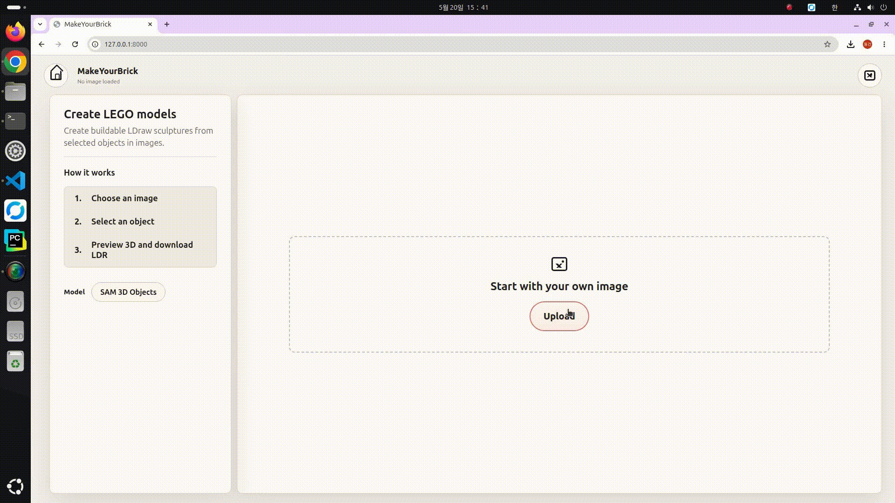
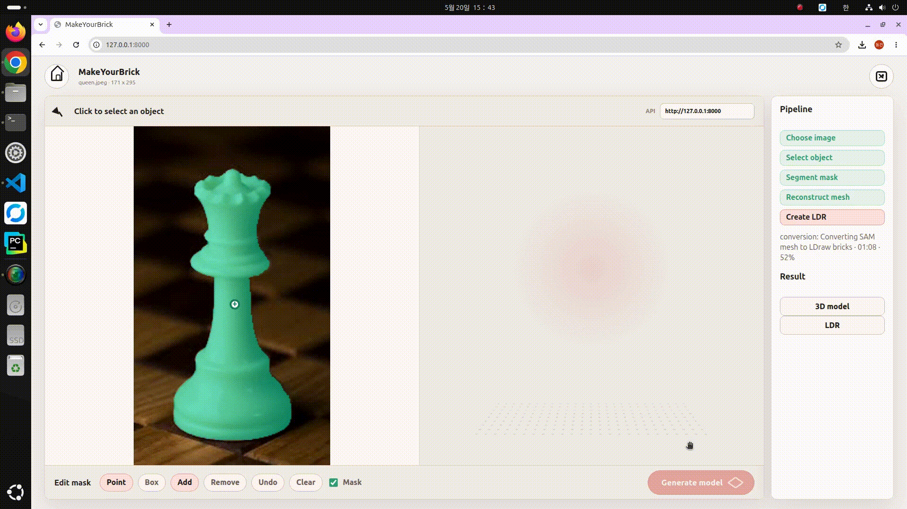

# MakeYourBrick

MakeYourBrick turns a single image into a LEGO-style LDraw `.ldr` sculpture.
The local app uses SAM2 for interactive object masks, SAM 3D Objects for
single-image 3D reconstruction, and a Studio-like brick conversion pipeline for
the final model.

## Demo






## Pipeline

```text
image
  -> SAM2 interactive mask
  -> SAM 3D Objects raw GLB mesh
  -> browser GLB preview
  -> Y-up mesh normalization
  -> auto or explicit base-size voxelization
  -> Studio-style shell/detail target
  -> color-aware Studio brick tiling
  -> downloadable LDraw .ldr
```

## Current Features

- Local FastAPI web app at `http://127.0.0.1:8000`
- Point and box object selection with SAM2 mask preview
- Real SAM 3D Objects integration through Docker
- Interactive raw GLB preview in the browser with WebGL and canvas fallback
- LDraw `.ldr` artifact download
- OBJ/GLB/STL mesh-to-LDraw CLI path
- Auto base-size selection from `16/24/32/48`, tuned so dense tall objects like the queen example resolve to `32`
- Mesh color sampling from vertex colors, face colors, UV textures, or material diffuse color
- Shadow softening before LDraw color quantization to reduce black/dark shadow artifacts
- Studio-like brick placement with layer steps and conversion reports

## Quick Start

Build the Docker image:

```bash
docker build -f docker/sam3d.Dockerfile -t makeyourbrick-sam3d:local .
```

Run the app:

```bash
docker run --rm --gpus all -p 8000:8000 \
  -e HF_TOKEN \
  -v "$(pwd)/outputs:/workspace/MakeYourBrick/outputs" \
  -v "$(pwd)/third_party/sam-3d-objects/torch-cache:/root/.cache/torch" \
  -v "$(pwd)/third_party/sam-3d-objects/hf-cache:/root/.cache/huggingface" \
  -e 'MAKEYOURBRICK_SAM_COMMAND=python /workspace/MakeYourBrick/scripts/sam3d_export.py --repo {repo} --depth-device staged-cuda --dino-dtype fp16 --image {image} --mask {mask} --output {output}' \
  makeyourbrick-sam3d:local
```

Open:

```text
http://127.0.0.1:8000
```

`HF_TOKEN` must have access to the gated `facebook/sam-3d-objects` model. The
Docker setup downloads SAM2 and SAM 3D weights into the mounted cache instead of
committing them to the repository.

## Web Flow

1. Upload an image.
2. Click or box-select the target object.
3. Check the SAM2 mask overlay.
4. Press `Generate model`.
5. Inspect the raw SAM 3D GLB in the right preview pane.
6. Download the `.ldr` artifact and open it in BrickLink Studio or another LDraw viewer.

## Mesh To LDraw

The mesh-only CLI remains useful for debugging or converting an existing mesh:

```bash
python scripts/mesh_to_ldr.py \
  --mesh queen.glb \
  --base-size-studs auto \
  --wall-thickness 2 \
  --base-thickness 3 \
  --color-strategy mesh \
  --report outputs/reports/queen_report.json \
  --output outputs/ldr/queen.ldr
```

## Verify

```bash
python -m compileall src scripts tests
python -m pytest
```

If your host Python does not have the full project dependencies, run tests in
the Docker image:

```bash
docker run --rm -v "$(pwd):/workspace/MakeYourBrick" \
  -w /workspace/MakeYourBrick \
  makeyourbrick-sam3d:local \
  python -m pytest
```

## Docs

- [Architecture](docs/architecture.md)
- [Usage](docs/usage.md)
- [Environment](docs/environment.md)
- [Testing](docs/testing.md)
- [Local SAM 3D Setup](docs/sam3d_local_setup.md)
- [Docker SAM 3D Runtime](docker/README.md)
- [References](docs/references.md)
